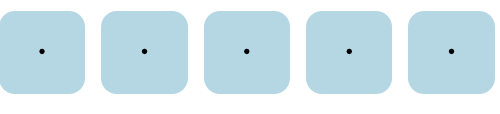
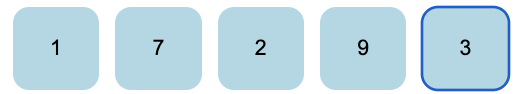
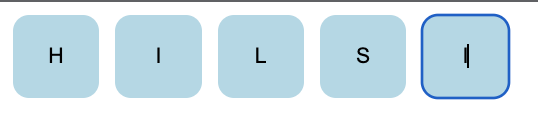
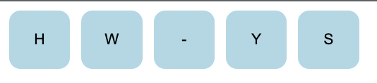

## svelte-code-input

A Svelte component for entering verification/PIN codes.

## Installation:

`npm install svelte-code-input`

or

`yarn add svelte-code-input`

## Usage:

**Use `SvelteCodeInput` in your component like this:**

Initialize a variable to hold the inputed code and set up an event listener for the `updateValue` event to keep track of the user's input.

`let code = '';`

`on:updateValue={(e) => (code = e.detail.value)}`

## Example

```
<script>
	import SvelteCodeInput from "svelte-code-input";

    let code = '';

    const customStyle = `background-color: lightblue;
    text-align:center; color: black; width: 50px; height: 50px; border-radius: 10px; border: grey; margin-right: 10px`;

    const customInvalidStyle = `background-color: pink;
    text-align:center; color: black; width: 50px; height: 50px; border-radius: 10px; border: grey; margin-right: 10px`;

</script>

<SvelteCodeInput
    size={5}
    isInputHidden={false}
    inputType="mixed"
    inputStyle= {customStyle}
    inputStyleInvalid={customInvalidStyle}
    isValid={false}
    containerstyle="display: flex"
    on:updateValue={(e) => (code = e.detail.value)}
/>

```

isInputHidden={true}



inputType="number"



inputType="text"



inputType="mixed"



## Props

Common props you may want to specify include:

| Prop Name         | Initial Value | Type                            | Description                                       |
| ----------------- | ------------- | ------------------------------- | ------------------------------------------------- |
| size              | 6             | `number`                        | The size of the input fields.                     |
| inputType         | `'text'`      | `'text' \| 'number' \| 'mixed'` | The type of input ('text', 'number', or 'mixed'). |
| containerstyle    | `undefined`   | `string`                        | Optional CSS styles for the inputs container.     |
| inputStyle        | `undefined`   | `string`                        | Optional CSS styles for the input elements.       |
| inputStyleInvalid | `undefined`   | `string`                        | Optional CSS styles for invalid input elements.   |
| pattern           | `undefined`   | `RegExp`                        | Optional pattern for input validation.            |
| isInputHidden     | `true`        | `boolean`                       | Whether the input is hidden (default: `true`).    |
| disabled          | `false`       | `boolean`                       | Whether the input is disabled (default: `false`). |
| isValid           | `true`        | `boolean`                       | Whether the input is valid (default: `true`).     |

## License

MIT Licensed. Copyright (c) Chiamaka Umeh 2023.
